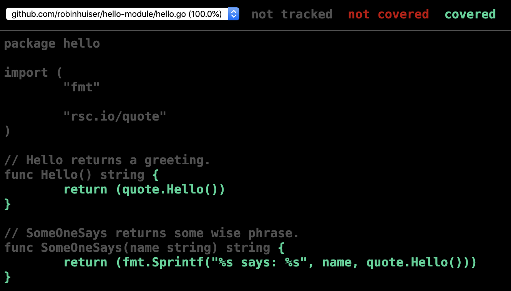

# Go module and unit tests

~~~bash
# Run test cases
$ go test
PASS
ok      github.com/robinhuiser/hello-module     0.069s

# Show code coverage
$ go test -coverprofile=c.out
PASS
coverage: 100.0% of statements
ok      github.com/robinhuiser/hello-module     0.205s
~~~

This is all cool - let's see the annotated source code considering code coverage:

~~~bash
$ go tool cover -html=c.out
~~~

... this will display:

